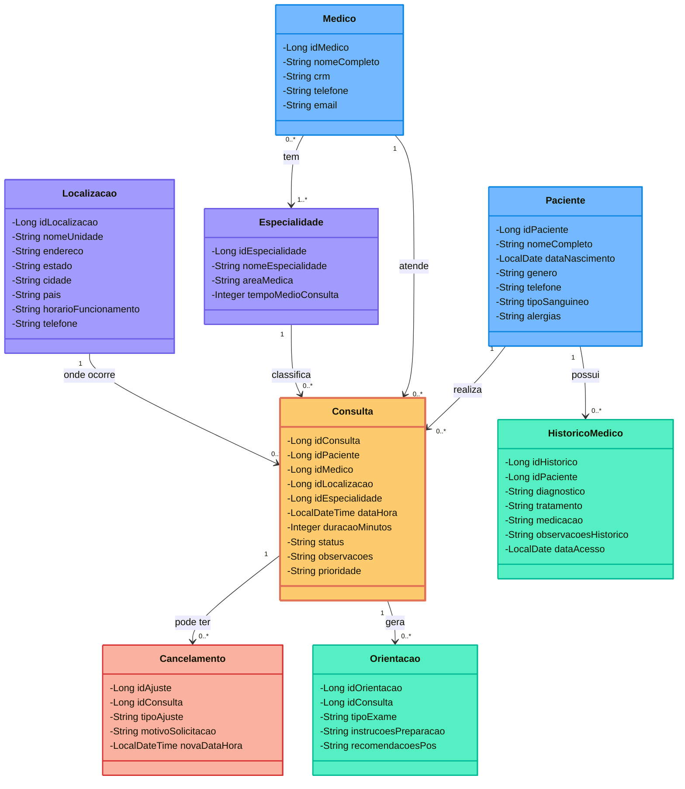

# 📐 DIAGRAMA DE CLASSES UML - EASEHC

**Projeto**: Sistema de Gestão de Consultas Médicas  
**Versão**: Atualizada - Novembro 2025

---

## 🎯 VISUALIZAÇÃO

### Renderização Automática:
- ✅ GitHub/GitLab
- ✅ Mermaid Live: https://mermaid.live/
- ✅ VS Code (extensão "Markdown Preview Mermaid Support")

---

## 📊 DIAGRAMA DE CLASSES - MODELO DE DOMÍNIO



---

## 🔗 RELACIONAMENTOS

### **Consulta (Classe Central)**
É a entidade principal que conecta todo o sistema:

| Relacionamento | Tipo | Multiplicidade | Descrição |
|----------------|------|----------------|-----------|
| **Paciente → Consulta** | Associação | 1 para N | Um paciente pode ter várias consultas |
| **Médico → Consulta** | Associação | 1 para N | Um médico atende várias consultas |
| **Especialidade → Consulta** | Associação | 1 para N | Uma especialidade classifica várias consultas |
| **Localização → Consulta** | Associação | 1 para N | Uma localização recebe várias consultas |
| **Consulta → Cancelamento** | Composição | 1 para N | Uma consulta pode ter cancelamentos/remarcações |
| **Consulta → Orientação** | Composição | 1 para N | Uma consulta gera orientações e exames |

### **Outras Entidades**

| Relacionamento | Tipo | Multiplicidade | Descrição |
|----------------|------|----------------|-----------|
| **Paciente → HistóricoMédico** | Composição | 1 para N | Paciente possui histórico médico |
| **Médico → Especialidade** | Associação | N para N | Médico pode ter várias especialidades |

---

## 🎨 LEGENDA DE CORES

| Cor | Tipo de Entidade |
|-----|------------------|
| 🔵 **Azul** | Entidades principais (Paciente, Médico) |
| 🟡 **Amarelo** (destaque) | **Consulta** - Entidade central do sistema |
| 🟣 **Roxo** | Entidades de referência (Especialidade, Localização) |
| 🔴 **Vermelho** | Entidades de controle (Cancelamento) |
| 🟢 **Verde** | Entidades de informação (Histórico, Orientação) |

---

## 📋 DESCRIÇÃO DAS CLASSES

### **Paciente**
Representa os pacientes do sistema de saúde.
- **Atributos principais**: ID, nome, data de nascimento, gênero
- **Informações médicas**: tipo sanguíneo, alergias
- **Contato**: telefone

### **Médico**
Representa os profissionais de saúde.
- **Identificação**: ID, nome, CRM (único)
- **Contato**: telefone, email

### **Consulta** ⭐ (Entidade Central)
Representa os agendamentos de consultas médicas.
- **Relacionamentos**: paciente, médico, especialidade, localização
- **Temporal**: data/hora, duração
- **Status**: Agendada, Cancelada, Realizada
- **Prioridade**: Alta, Baixa, Normal
- ⚠️ **Nota**: O método `listarTodos()` retorna apenas consultas AGENDADAS

### **Especialidade**
Áreas médicas disponíveis no sistema.
- **Exemplos**: Cardiologia, Pediatria, Ortopedia
- **Atributos**: nome, área médica, tempo médio de consulta

### **Localização**
Unidades de atendimento do sistema.
- **Atributos**: nome da unidade, endereço completo
- **Funcionamento**: horário, telefone

### **Cancelamento**
Registra cancelamentos ou remarcações de consultas.
- **Tipo**: Cancelamento ou Remarcação
- **Informações**: motivo, nova data (se remarcação)

### **HistoricoMedico**
Armazena histórico de saúde do paciente.
- **Informações clínicas**: diagnóstico, tratamento, medicação
- **Controle**: data de acesso, observações

### **Orientacao**
Orientações e exames solicitados em consultas.
- **Tipo de exame**: hemograma, radiografia, etc
- **Instruções**: preparação, recomendações pós-exame

---

## 🔄 FLUXO PRINCIPAL DO SISTEMA

```
1. PACIENTE é cadastrado
   ↓
2. MÉDICO é cadastrado com ESPECIALIDADE(S)
   ↓
3. CONSULTA é agendada vinculando:
   - Paciente
   - Médico
   - Especialidade
   - Localização
   ↓
4. CONSULTA pode gerar:
   - ORIENTAÇÕES (exames, instruções)
   - CANCELAMENTO (se necessário)
   ↓
5. HISTÓRICO MÉDICO do paciente é atualizado
```

---

## 📊 MULTIPLICIDADES IMPORTANTES

### **Consulta (N) → (1) Paciente**
- Uma consulta pertence a apenas um paciente
- Um paciente pode ter várias consultas

### **Consulta (N) → (1) Médico**
- Uma consulta é atendida por apenas um médico
- Um médico pode atender várias consultas

### **Médico (N) ↔ (N) Especialidade**
- Um médico pode ter várias especialidades
- Uma especialidade pode ser de vários médicos
- Implementado via tabela `T_EASEHC_MED_ESP`

### **Consulta (1) → (N) Orientação**
- Uma consulta pode gerar várias orientações
- Uma orientação pertence a apenas uma consulta
- **Composição**: Se a consulta for deletada, orientações também são

---

## 🎯 REGRAS DE NEGÓCIO NO MODELO

### **Consulta**
1. ✅ Status deve ser: "Agendada", "Cancelada" ou "Realizada"
2. ✅ Prioridade deve ser: "Alta", "Baixa" ou "Normal"
3. ✅ Data/hora não pode ser no passado
4. ✅ Médico não pode ter consultas sobrepostas no mesmo horário
5. ✅ Não pode cancelar consulta já realizada

### **Médico**
1. ✅ CRM deve ser único no sistema
2. ✅ Email deve ser válido e único

### **Paciente**
1. ✅ Gênero deve ser: "F", "M" ou "O"
2. ✅ Tipo sanguíneo deve ser válido: A+, A-, AB+, AB-, B+, B-, O+, O-
3. ✅ Data de nascimento não pode ser futura

---

## 📐 PADRÕES UTILIZADOS

### **Camada de Persistência (DAO)**
Cada classe possui um DAO correspondente:
- `PacienteDAO`, `MedicoDAO`, `ConsultaDAO`, etc.
- CRUD completo implementado

### **Camada de Negócio (Service)**
Validações e regras de negócio:
- `PacienteService`, `MedicoService`, `ConsultaService`, etc.
- Validações antes de persistir

### **Camada de Apresentação (Resource)**
API RESTful:
- `PacienteResource`, `MedicoResource`, `ConsultaResource`, etc.
- Endpoints HTTP (GET, POST, PUT, DELETE)

---

## 🗄️ MAPEAMENTO PARA BANCO DE DADOS

| Classe Java | Tabela Oracle | Chave Primária |
|-------------|---------------|----------------|
| Paciente | T_EASEHC_PACIENTE | ID_PACIENTE |
| Medico | T_EASEHC_MEDICO | ID_MEDICO |
| Consulta | T_EASEHC_CONSULTA | ID_CONSULTA |
| Especialidade | T_EASEHC_ESPECIALIDADE | ID_ESP |
| Localizacao | T_EASEHC_LOCALIZACAO | ID_LOCAL |
| Cancelamento | T_EASEHC_CANREM | ID_AJUSTE |
| HistoricoMedico | T_EASEHC_HISTORICO | ID_HIST |
| Orientacao | T_EASEHC_ORIENTACAO | ID_ORIENT |

### **Tabela Associativa**
- `T_EASEHC_MED_ESP`: Relaciona Médico com Especialidade (N:N)

---

**Versão**: 1.0 - UML Tradicional  
**Projeto**: EaseHC - Sistema de Gestão de Consultas Médicas  
**Grupo**: Samara Vilela (RM566133), Felipe Conte (RM562248), Altamir Lima (RM562906)

