# 📊 DIAGRAMA UML COMPLETO - SISTEMA EASEHC

**Projeto**: Sistema de Gestão de Consultas Médicas  
**Versão**: Atualizada - Novembro 2025

---

## 🎯 COMO VISUALIZAR

### Opção 1: GitHub/GitLab
Visualize este arquivo diretamente no GitHub/GitLab - o Mermaid renderiza automaticamente.

### Opção 2: Mermaid Live Editor
1. Acesse: https://mermaid.live/
2. Cole o código abaixo
3. Exporte como PNG/SVG

### Opção 3: VS Code
Instale a extensão "Markdown Preview Mermaid Support"

---

## 📐 DIAGRAMA COMPLETO - ARQUITETURA EM CAMADAS

```mermaid
graph TB
    subgraph EXCEPTION["🚨 CAMADA DE EXCEÇÕES"]
        RuntimeEx[RuntimeException]
        ValidationEx[ValidationException]
        ResourceNotFoundEx[ResourceNotFoundException]
        BusinessRuleEx[BusinessRuleException]
        DatabaseEx[DatabaseException]
        
        RuntimeEx --> ValidationEx
        RuntimeEx --> ResourceNotFoundEx
        RuntimeEx --> BusinessRuleEx
        RuntimeEx --> DatabaseEx
    end

    subgraph RESOURCE["🌐 CAMADA RESOURCE - API REST"]
        PacienteRes[PacienteResource<br/>+ listarTodos<br/>+ buscarPorId<br/>+ criar<br/>+ atualizar<br/>+ deletar<br/>+ buscarPorNome]
        MedicoRes[MedicoResource<br/>+ listarTodos<br/>+ buscarPorId<br/>+ criar<br/>+ atualizar<br/>+ deletar<br/>+ buscarPorCrm<br/>+ listarPorEspecialidade]
        ConsultaRes[ConsultaResource<br/>+ listarTodos ⚠️ AGENDADAS<br/>+ buscarPorId<br/>+ criar<br/>+ atualizar<br/>+ deletar<br/>+ listarPorPaciente<br/>+ listarPorMedico<br/>+ listarPorStatus<br/>+ cancelar]
        EspecialidadeRes[EspecialidadeResource<br/>+ listarTodos<br/>+ buscarPorId<br/>+ criar<br/>+ atualizar<br/>+ deletar]
        LocalizacaoRes[LocalizacaoResource<br/>+ listarTodos<br/>+ buscarPorId<br/>+ criar<br/>+ atualizar<br/>+ deletar<br/>+ listarPorCidade]
        ResponseEntity[ResponseEntity<T><br/>+ body: T<br/>+ statusCode: int<br/>+ message: String]
    end

    subgraph SERVICE["⚙️ CAMADA SERVICE - REGRAS DE NEGÓCIO"]
        PacienteServ[PacienteService<br/>+ criar<br/>+ buscarPorId<br/>+ listarTodos<br/>+ atualizar<br/>+ deletar<br/>+ buscarPorNome<br/>- validarPaciente<br/>- validarIdPaciente]
        MedicoServ[MedicoService<br/>+ criar<br/>+ buscarPorId<br/>+ listarTodos<br/>+ atualizar<br/>+ deletar<br/>+ buscarPorCrm<br/>+ listarPorEspecialidade<br/>- validarMedico<br/>- validarCrmUnico]
        ConsultaServ[ConsultaService<br/>+ criar<br/>+ buscarPorId<br/>+ listarTodos ⚠️ AGENDADAS<br/>+ atualizar<br/>+ deletar<br/>+ cancelar<br/>+ listarPorPaciente<br/>+ listarPorMedico<br/>+ listarPorStatus<br/>- validarConsulta<br/>- validarDisponibilidade<br/>- validarEntidadesRelacionadas]
        EspecialidadeServ[EspecialidadeService<br/>+ criar<br/>+ buscarPorId<br/>+ listarTodos<br/>+ atualizar<br/>+ deletar<br/>- validarEspecialidade]
        LocalizacaoServ[LocalizacaoService<br/>+ criar<br/>+ buscarPorId<br/>+ listarTodos<br/>+ atualizar<br/>+ deletar<br/>+ listarPorCidade<br/>- validarLocalizacao]
    end

    subgraph DAO["💾 CAMADA DAO - PERSISTÊNCIA"]
        PacienteDAO[PacienteDAO<br/>+ criar<br/>+ buscarPorId<br/>+ listarTodos<br/>+ atualizar<br/>+ deletar<br/>+ buscarPorNome]
        MedicoDAO[MedicoDAO<br/>+ criar<br/>+ buscarPorId<br/>+ listarTodos<br/>+ atualizar<br/>+ deletar<br/>+ buscarPorCrm<br/>+ listarPorEspecialidade]
        ConsultaDAO[ConsultaDAO<br/>+ criar<br/>+ buscarPorId<br/>+ listarTodos ⚠️ AGENDADAS<br/>+ atualizar<br/>+ deletar<br/>+ listarPorPaciente<br/>+ listarPorMedico<br/>+ listarPorStatus]
        EspecialidadeDAO[EspecialidadeDAO<br/>+ criar<br/>+ buscarPorId<br/>+ listarTodos<br/>+ atualizar<br/>+ deletar]
        LocalizacaoDAO[LocalizacaoDAO<br/>+ criar<br/>+ buscarPorId<br/>+ listarTodos<br/>+ atualizar<br/>+ deletar<br/>+ listarPorCidade]
        CancelamentoDAO[CancelamentoDAO<br/>+ criar<br/>+ buscarPorId<br/>+ listarTodos<br/>+ atualizar<br/>+ deletar<br/>+ listarPorConsulta]
        HistoricoDAO[HistoricoMedicoDAO<br/>+ criar<br/>+ buscarPorId<br/>+ listarTodos<br/>+ atualizar<br/>+ deletar<br/>+ listarPorPaciente]
        OrientacaoDAO[OrientacaoDAO<br/>+ criar<br/>+ buscarPorId<br/>+ listarTodos<br/>+ atualizar<br/>+ deletar<br/>+ listarPorConsulta]
        ConexaoBD[ConexaoBD SINGLETON<br/>+ getConexao<br/>+ commit<br/>+ rollback<br/>+ fecharConexao<br/>+ testarConexao]
    end

    subgraph MODEL["📦 CAMADA MODEL - DTOs"]
        Paciente[Paciente<br/>- idPaciente: Long<br/>- nomeCompleto: String<br/>- dataNascimento: LocalDate<br/>- genero: String<br/>- telefone: String<br/>- tipoSanguineo: String<br/>- alergias: String]
        Medico[Medico<br/>- idMedico: Long<br/>- nomeCompleto: String<br/>- crm: String<br/>- telefone: String<br/>- email: String]
        Consulta[Consulta<br/>- idConsulta: Long<br/>- idPaciente: Long<br/>- idMedico: Long<br/>- idLocalizacao: Long<br/>- idEspecialidade: Long<br/>- dataHora: LocalDateTime<br/>- duracaoMinutos: Integer<br/>- status: String<br/>- observacoes: String<br/>- prioridade: String]
        Especialidade[Especialidade<br/>- idEspecialidade: Long<br/>- nomeEspecialidade: String<br/>- areaMedica: String<br/>- tempoMedioConsulta: Integer]
        Localizacao[Localizacao<br/>- idLocalizacao: Long<br/>- nomeUnidade: String<br/>- endereco: String<br/>- estado: String<br/>- cidade: String<br/>- pais: String<br/>- horarioFuncionamento: String<br/>- telefone: String]
        Cancelamento[Cancelamento<br/>- idAjuste: Long<br/>- idConsulta: Long<br/>- tipoAjuste: String<br/>- motivoSolicitacao: String<br/>- novaDataHora: LocalDateTime]
        HistoricoMedico[HistoricoMedico<br/>- idHistorico: Long<br/>- idPaciente: Long<br/>- diagnostico: String<br/>- tratamento: String<br/>- medicacao: String<br/>- observacoesHistorico: String<br/>- dataAcesso: LocalDate]
        Orientacao[Orientacao<br/>- idOrientacao: Long<br/>- idConsulta: Long<br/>- tipoExame: String<br/>- instrucoesPreparacao: String<br/>- recomendacoesPos: String]
    end

    %% Relacionamentos Resource -> Service
    PacienteRes -->|usa| PacienteServ
    MedicoRes -->|usa| MedicoServ
    ConsultaRes -->|usa| ConsultaServ
    EspecialidadeRes -->|usa| EspecialidadeServ
    LocalizacaoRes -->|usa| LocalizacaoServ

    PacienteRes -.->|retorna| ResponseEntity
    MedicoRes -.->|retorna| ResponseEntity
    ConsultaRes -.->|retorna| ResponseEntity
    EspecialidadeRes -.->|retorna| ResponseEntity
    LocalizacaoRes -.->|retorna| ResponseEntity

    %% Relacionamentos Service -> DAO
    PacienteServ -->|usa| PacienteDAO
    MedicoServ -->|usa| MedicoDAO
    ConsultaServ -->|usa| ConsultaDAO
    ConsultaServ -->|usa| PacienteDAO
    ConsultaServ -->|usa| MedicoDAO
    EspecialidadeServ -->|usa| EspecialidadeDAO
    LocalizacaoServ -->|usa| LocalizacaoDAO

    %% Relacionamentos DAO -> ConexaoBD
    PacienteDAO -->|usa| ConexaoBD
    MedicoDAO -->|usa| ConexaoBD
    ConsultaDAO -->|usa| ConexaoBD
    EspecialidadeDAO -->|usa| ConexaoBD
    LocalizacaoDAO -->|usa| ConexaoBD
    CancelamentoDAO -->|usa| ConexaoBD
    HistoricoDAO -->|usa| ConexaoBD
    OrientacaoDAO -->|usa| ConexaoBD

    %% Relacionamentos DAO -> Model
    PacienteDAO -.->|manipula| Paciente
    MedicoDAO -.->|manipula| Medico
    ConsultaDAO -.->|manipula| Consulta
    EspecialidadeDAO -.->|manipula| Especialidade
    LocalizacaoDAO -.->|manipula| Localizacao
    CancelamentoDAO -.->|manipula| Cancelamento
    HistoricoDAO -.->|manipula| HistoricoMedico
    OrientacaoDAO -.->|manipula| Orientacao

    %% Relacionamentos entre Models
    Consulta -.->|referencia| Paciente
    Consulta -.->|referencia| Medico
    Consulta -.->|referencia| Especialidade
    Consulta -.->|referencia| Localizacao
    Cancelamento -.->|referencia| Consulta
    Orientacao -.->|referencia| Consulta
    HistoricoMedico -.->|referencia| Paciente

    %% Exceções usadas pelas camadas
    PacienteServ -.->|lança| ValidationEx
    PacienteServ -.->|lança| ResourceNotFoundEx
    MedicoServ -.->|lança| ValidationEx
    MedicoServ -.->|lança| ResourceNotFoundEx
    ConsultaServ -.->|lança| ValidationEx
    ConsultaServ -.->|lança| ResourceNotFoundEx
    ConsultaServ -.->|lança| BusinessRuleEx
    PacienteDAO -.->|lança| DatabaseEx
    MedicoDAO -.->|lança| DatabaseEx
    ConsultaDAO -.->|lança| DatabaseEx

    style RuntimeEx fill:#ff6b6b
    style ValidationEx fill:#ffa07a
    style ResourceNotFoundEx fill:#ffa07a
    style BusinessRuleEx fill:#ffa07a
    style DatabaseEx fill:#ffa07a
    
    style PacienteRes fill:#4ecdc4
    style MedicoRes fill:#4ecdc4
    style ConsultaRes fill:#4ecdc4
    style EspecialidadeRes fill:#4ecdc4
    style LocalizacaoRes fill:#4ecdc4
    style ResponseEntity fill:#95e1d3
    
    style PacienteServ fill:#f9ca24
    style MedicoServ fill:#f9ca24
    style ConsultaServ fill:#f9ca24
    style EspecialidadeServ fill:#f9ca24
    style LocalizacaoServ fill:#f9ca24
    
    style PacienteDAO fill:#a29bfe
    style MedicoDAO fill:#a29bfe
    style ConsultaDAO fill:#a29bfe
    style EspecialidadeDAO fill:#a29bfe
    style LocalizacaoDAO fill:#a29bfe
    style CancelamentoDAO fill:#a29bfe
    style HistoricoDAO fill:#a29bfe
    style OrientacaoDAO fill:#a29bfe
    style ConexaoBD fill:#6c5ce7
    
    style Paciente fill:#74b9ff
    style Medico fill:#74b9ff
    style Consulta fill:#74b9ff
    style Especialidade fill:#74b9ff
    style Localizacao fill:#74b9ff
    style Cancelamento fill:#74b9ff
    style HistoricoMedico fill:#74b9ff
    style Orientacao fill:#74b9ff
```

---

## 🎨 LEGENDA DE CORES

| Cor | Camada |
|-----|--------|
| 🔴 Vermelho | Exceções |
| 🔵 Azul Turquesa | Resources (API REST) |
| 🟡 Amarelo | Services (Negócio) |
| 🟣 Roxo | DAOs (Persistência) |
| 🔵 Azul Claro | Models (DTOs) |

---

## 📋 RESUMO DA ARQUITETURA

### **Total de Classes: 32**

| Camada | Quantidade | Classes |
|--------|-----------|---------|
| **Model (DTOs)** | 8 | Paciente, Medico, Consulta, Especialidade, Localizacao, Cancelamento, HistoricoMedico, Orientacao |
| **DAO** | 9 | PacienteDAO, MedicoDAO, ConsultaDAO, EspecialidadeDAO, LocalizacaoDAO, CancelamentoDAO, HistoricoMedicoDAO, OrientacaoDAO, ConexaoBD |
| **Service** | 5 | PacienteService, MedicoService, ConsultaService, EspecialidadeService, LocalizacaoService |
| **Resource** | 6 | PacienteResource, MedicoResource, ConsultaResource, EspecialidadeResource, LocalizacaoResource, ResponseEntity |
| **Exception** | 4 | ValidationException, ResourceNotFoundException, BusinessRuleException, DatabaseException |

---

## ⚠️ NOTAS IMPORTANTES

### **Método `listarTodos()` da ConsultaDAO/Service/Resource:**
- ✅ Retorna **APENAS consultas com status "Agendada"**
- ✅ Para listar consultas com outros status, usar `listarPorStatus(String status)`

### **Padrões de Projeto Implementados:**
- ✅ **DAO** (Data Access Object)
- ✅ **Service Layer**
- ✅ **MVC** (Model-View-Controller)
- ✅ **Singleton** (ConexaoBD)
- ✅ **Dependency Injection**

### **Regras de Negócio Principais:**
1. ✅ Médico não pode ter consultas sobrepostas
2. ✅ Não pode cancelar consulta já realizada
3. ✅ CRM do médico deve ser único
4. ✅ Validação de disponibilidade de horário
5. ✅ Validação de integridade referencial

---

## 📊 RELACIONAMENTOS

### **Consulta → Outras Entidades:**
- `idPaciente` → Paciente
- `idMedico` → Medico
- `idEspecialidade` → Especialidade
- `idLocalizacao` → Localizacao

### **Cancelamento/Orientacao → Consulta:**
- `idConsulta` → Consulta

### **HistoricoMedico → Paciente:**
- `idPaciente` → Paciente

---

## 🚀 ENDPOINTS DA API

### Pacientes: `/api/pacientes`
- GET `/` - Lista todos
- GET `/{id}` - Busca por ID
- POST `/` - Criar novo
- PUT `/{id}` - Atualizar
- DELETE `/{id}` - Deletar
- GET `/buscar?nome=X` - Buscar por nome

### Médicos: `/api/medicos`
- GET `/` - Lista todos
- GET `/{id}` - Busca por ID
- POST `/` - Criar novo
- PUT `/{id}` - Atualizar
- DELETE `/{id}` - Deletar
- GET `/crm/{crm}` - Buscar por CRM
- GET `/especialidade/{id}` - Listar por especialidade

### Consultas: `/api/consultas`
- GET `/` - Lista todas **AGENDADAS** ⚠️
- GET `/{id}` - Busca por ID
- POST `/` - Criar nova
- PUT `/{id}` - Atualizar
- DELETE `/{id}` - Deletar
- GET `/paciente/{id}` - Listar por paciente
- GET `/medico/{id}` - Listar por médico
- GET `/status/{status}` - Listar por status
- PUT `/{id}/cancelar` - Cancelar consulta

### Especialidades: `/api/especialidades`
- GET `/` - Lista todas
- GET `/{id}` - Busca por ID
- POST `/` - Criar nova
- PUT `/{id}` - Atualizar
- DELETE `/{id}` - Deletar

### Localizações: `/api/localizacoes`
- GET `/` - Lista todas
- GET `/{id}` - Busca por ID
- POST `/` - Criar nova
- PUT `/{id}` - Atualizar
- DELETE `/{id}` - Deletar
- GET `/cidade/{cidade}` - Listar por cidade

---

**Última Atualização**: Novembro 2025  
**Versão**: 1.0 - Completa e Atualizada  
**Projeto**: EaseHC - Sistema de Gestão de Consultas Médicas  
**Grupo**: Samara Vilela (RM566133), Felipe Conte (RM562248), Altamir Lima (RM562906)

