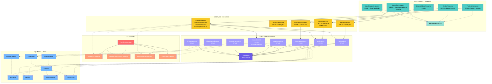

# 📊 DIAGRAMA UML COMPLETO - SISTEMA EASEHC

**Projeto**: Sistema de Gestão de Consultas Médicas  
**Versão**: Atualizada - Novembro 2025

---

## 🎯 COMO VISUALIZAR

### Opção 1: GitHub/GitLab
Visualize este arquivo diretamente no GitHub/GitLab - o Mermaid renderiza automaticamente.

### Opção 2: Mermaid Live Editor
1. Acesse: https://mermaid.live/
2. Cole o código abaixo
3. Exporte como PNG/SVG

### Opção 3: VS Code
Instale a extensão "Markdown Preview Mermaid Support"

---

## 📐 DIAGRAMA SIMPLIFICADO - ARQUITETURA EM CAMADAS

```mermaid
graph TB
    subgraph EXCEPTION["🚨 EXCEÇÕES"]
        RuntimeEx[RuntimeException]
        ValidationEx[ValidationException]
        ResourceNotFoundEx[ResourceNotFoundException]
        BusinessRuleEx[BusinessRuleException]
        DatabaseEx[DatabaseException]
        
        RuntimeEx --> ValidationEx
        RuntimeEx --> ResourceNotFoundEx
        RuntimeEx --> BusinessRuleEx
        RuntimeEx --> DatabaseEx
    end

    subgraph RESOURCE["🌐 RESOURCE - API REST"]
        PacienteRes[PacienteResource<br/>CRUD + buscarPorNome]
        MedicoRes[MedicoResource<br/>CRUD + buscarPorCrm]
        ConsultaRes[ConsultaResource<br/>CRUD + listarAgendadas ⚠️<br/>+ cancelar]
        EspecialidadeRes[EspecialidadeResource<br/>CRUD]
        LocalizacaoRes[LocalizacaoResource<br/>CRUD + listarPorCidade]
        ResponseEntity[ResponseEntity&lt;T&gt;]
    end

    subgraph SERVICE["⚙️ SERVICE - NEGÓCIO"]
        PacienteServ[PacienteService<br/>CRUD + Validações]
        MedicoServ[MedicoService<br/>CRUD + Validações<br/>+ CRM único]
        ConsultaServ[ConsultaService<br/>CRUD + Validações<br/>+ Conflito horários<br/>+ listarAgendadas ⚠️]
        EspecialidadeServ[EspecialidadeService<br/>CRUD + Validações]
        LocalizacaoServ[LocalizacaoService<br/>CRUD + Validações]
    end

    subgraph DAO["💾 DAO - PERSISTÊNCIA"]
        PacienteDAO[PacienteDAO<br/>CRUD]
        MedicoDAO[MedicoDAO<br/>CRUD]
        ConsultaDAO[ConsultaDAO<br/>CRUD<br/>listarAgendadas ⚠️]
        EspecialidadeDAO[EspecialidadeDAO<br/>CRUD]
        LocalizacaoDAO[LocalizacaoDAO<br/>CRUD]
        CancelamentoDAO[CancelamentoDAO<br/>CRUD]
        HistoricoDAO[HistoricoMedicoDAO<br/>CRUD]
        OrientacaoDAO[OrientacaoDAO<br/>CRUD]
        ConexaoBD[ConexaoBD<br/>SINGLETON]
    end

    subgraph MODEL["📦 MODEL - DTOs"]
        Paciente[Paciente]
        Medico[Medico]
        Consulta[Consulta]
        Especialidade[Especialidade]
        Localizacao[Localizacao]
        Cancelamento[Cancelamento]
        HistoricoMedico[HistoricoMedico]
        Orientacao[Orientacao]
    end

    %% Relacionamentos Resource -> Service
    PacienteRes --> PacienteServ
    MedicoRes --> MedicoServ
    ConsultaRes --> ConsultaServ
    EspecialidadeRes --> EspecialidadeServ
    LocalizacaoRes --> LocalizacaoServ

    PacienteRes -.-> ResponseEntity
    MedicoRes -.-> ResponseEntity
    ConsultaRes -.-> ResponseEntity
    EspecialidadeRes -.-> ResponseEntity
    LocalizacaoRes -.-> ResponseEntity

    %% Relacionamentos Service -> DAO
    PacienteServ --> PacienteDAO
    MedicoServ --> MedicoDAO
    ConsultaServ --> ConsultaDAO
    ConsultaServ --> PacienteDAO
    ConsultaServ --> MedicoDAO
    EspecialidadeServ --> EspecialidadeDAO
    LocalizacaoServ --> LocalizacaoDAO

    %% Relacionamentos DAO -> ConexaoBD
    PacienteDAO --> ConexaoBD
    MedicoDAO --> ConexaoBD
    ConsultaDAO --> ConexaoBD
    EspecialidadeDAO --> ConexaoBD
    LocalizacaoDAO --> ConexaoBD
    CancelamentoDAO --> ConexaoBD
    HistoricoDAO --> ConexaoBD
    OrientacaoDAO --> ConexaoBD

    %% Relacionamentos DAO -> Model
    PacienteDAO -.-> Paciente
    MedicoDAO -.-> Medico
    ConsultaDAO -.-> Consulta
    EspecialidadeDAO -.-> Especialidade
    LocalizacaoDAO -.-> Localizacao
    CancelamentoDAO -.-> Cancelamento
    HistoricoDAO -.-> HistoricoMedico
    OrientacaoDAO -.-> Orientacao

    %% Relacionamentos entre Models
    Consulta -.-> Paciente
    Consulta -.-> Medico
    Consulta -.-> Especialidade
    Consulta -.-> Localizacao
    Cancelamento -.-> Consulta
    Orientacao -.-> Consulta
    HistoricoMedico -.-> Paciente

    %% Exceções
    ConsultaServ -.-> ValidationEx
    ConsultaServ -.-> ResourceNotFoundEx
    ConsultaServ -.-> BusinessRuleEx
    ConsultaDAO -.-> DatabaseEx

    style RuntimeEx fill:#ff6b6b,color:#fff
    style ValidationEx fill:#ffa07a,color:#fff
    style ResourceNotFoundEx fill:#ffa07a,color:#fff
    style BusinessRuleEx fill:#ffa07a,color:#fff
    style DatabaseEx fill:#ffa07a,color:#fff
    
    style PacienteRes fill:#4ecdc4,color:#000
    style MedicoRes fill:#4ecdc4,color:#000
    style ConsultaRes fill:#4ecdc4,color:#000
    style EspecialidadeRes fill:#4ecdc4,color:#000
    style LocalizacaoRes fill:#4ecdc4,color:#000
    style ResponseEntity fill:#95e1d3,color:#000
    
    style PacienteServ fill:#f9ca24,color:#000
    style MedicoServ fill:#f9ca24,color:#000
    style ConsultaServ fill:#f9ca24,color:#000
    style EspecialidadeServ fill:#f9ca24,color:#000
    style LocalizacaoServ fill:#f9ca24,color:#000
    
    style PacienteDAO fill:#a29bfe,color:#fff
    style MedicoDAO fill:#a29bfe,color:#fff
    style ConsultaDAO fill:#a29bfe,color:#fff
    style EspecialidadeDAO fill:#a29bfe,color:#fff
    style LocalizacaoDAO fill:#a29bfe,color:#fff
    style CancelamentoDAO fill:#a29bfe,color:#fff
    style HistoricoDAO fill:#a29bfe,color:#fff
    style OrientacaoDAO fill:#a29bfe,color:#fff
    style ConexaoBD fill:#6c5ce7,color:#fff
    
    style Paciente fill:#74b9ff,color:#000
    style Medico fill:#74b9ff,color:#000
    style Consulta fill:#74b9ff,color:#000
    style Especialidade fill:#74b9ff,color:#000
    style Localizacao fill:#74b9ff,color:#000
    style Cancelamento fill:#74b9ff,color:#000
    style HistoricoMedico fill:#74b9ff,color:#000
    style Orientacao fill:#74b9ff,color:#000
```

---

## ✨ MELHORIAS DA VERSÃO SIMPLIFICADA

### **O que foi otimizado:**

✅ **Redução visual em ~70%**
- Removidos detalhes de métodos individuais
- Mantido apenas "CRUD" para operações básicas
- Destacados apenas métodos especiais

✅ **Mais legível**
- Boxes menores e mais limpos
- Menos linhas cruzadas
- Foco na arquitetura geral

✅ **Mantém todas as 32 classes**
- Nenhuma informação perdida
- Estrutura completa preservada
- Relacionamentos claros

✅ **Destaque para o importante**
- ⚠️ "listarAgendadas" em destaque
- Regras de negócio principais visíveis
- Padrões Singleton identificados

---

## 🎨 LEGENDA DE CORES

| Cor | Camada |
|-----|--------|
| 🔴 Vermelho | Exceções |
| 🔵 Azul Turquesa | Resources (API REST) |
| 🟡 Amarelo | Services (Negócio) |
| 🟣 Roxo | DAOs (Persistência) |
| 🔵 Azul Claro | Models (DTOs) |

---

## 📋 RESUMO DA ARQUITETURA

### **Total de Classes: 32**

| Camada | Quantidade | Classes |
|--------|-----------|---------|
| **Model (DTOs)** | 8 | Paciente, Medico, Consulta, Especialidade, Localizacao, Cancelamento, HistoricoMedico, Orientacao |
| **DAO** | 9 | PacienteDAO, MedicoDAO, ConsultaDAO, EspecialidadeDAO, LocalizacaoDAO, CancelamentoDAO, HistoricoMedicoDAO, OrientacaoDAO, ConexaoBD |
| **Service** | 5 | PacienteService, MedicoService, ConsultaService, EspecialidadeService, LocalizacaoService |
| **Resource** | 6 | PacienteResource, MedicoResource, ConsultaResource, EspecialidadeResource, LocalizacaoResource, ResponseEntity |
| **Exception** | 4 | ValidationException, ResourceNotFoundException, BusinessRuleException, DatabaseException |

---

## ⚠️ NOTAS IMPORTANTES

### **Método `listarTodos()` da ConsultaDAO/Service/Resource:**
- ✅ Retorna **APENAS consultas com status "Agendada"**
- ✅ Para listar consultas com outros status, usar `listarPorStatus(String status)`

### **Padrões de Projeto Implementados:**
- ✅ **DAO** (Data Access Object)
- ✅ **Service Layer**
- ✅ **MVC** (Model-View-Controller)
- ✅ **Singleton** (ConexaoBD)
- ✅ **Dependency Injection**

### **Regras de Negócio Principais:**
1. ✅ Médico não pode ter consultas sobrepostas
2. ✅ Não pode cancelar consulta já realizada
3. ✅ CRM do médico deve ser único
4. ✅ Validação de disponibilidade de horário
5. ✅ Validação de integridade referencial

---

## 📊 RELACIONAMENTOS

### **Consulta → Outras Entidades:**
- `idPaciente` → Paciente
- `idMedico` → Medico
- `idEspecialidade` → Especialidade
- `idLocalizacao` → Localizacao

### **Cancelamento/Orientacao → Consulta:**
- `idConsulta` → Consulta

### **HistoricoMedico → Paciente:**
- `idPaciente` → Paciente

---

## 🚀 ENDPOINTS DA API

### Pacientes: `/api/pacientes`
- GET `/` - Lista todos
- GET `/{id}` - Busca por ID
- POST `/` - Criar novo
- PUT `/{id}` - Atualizar
- DELETE `/{id}` - Deletar
- GET `/buscar?nome=X` - Buscar por nome

### Médicos: `/api/medicos`
- GET `/` - Lista todos
- GET `/{id}` - Busca por ID
- POST `/` - Criar novo
- PUT `/{id}` - Atualizar
- DELETE `/{id}` - Deletar
- GET `/crm/{crm}` - Buscar por CRM
- GET `/especialidade/{id}` - Listar por especialidade

### Consultas: `/api/consultas`
- GET `/` - Lista todas **AGENDADAS** ⚠️
- GET `/{id}` - Busca por ID
- POST `/` - Criar nova
- PUT `/{id}` - Atualizar
- DELETE `/{id}` - Deletar
- GET `/paciente/{id}` - Listar por paciente
- GET `/medico/{id}` - Listar por médico
- GET `/status/{status}` - Listar por status
- PUT `/{id}/cancelar` - Cancelar consulta

### Especialidades: `/api/especialidades`
- GET `/` - Lista todas
- GET `/{id}` - Busca por ID
- POST `/` - Criar nova
- PUT `/{id}` - Atualizar
- DELETE `/{id}` - Deletar

### Localizações: `/api/localizacoes`
- GET `/` - Lista todas
- GET `/{id}` - Busca por ID
- POST `/` - Criar nova
- PUT `/{id}` - Atualizar
- DELETE `/{id}` - Deletar
- GET `/cidade/{cidade}` - Listar por cidade

---

**Versão**: 1.0 - Completa e Atualizada  
**Projeto**: EaseHC - Sistema de Gestão de Consultas Médicas  
**Grupo**: Samara Vilela (RM566133), Felipe Conte (RM562248), Altamir Lima (RM562906)

